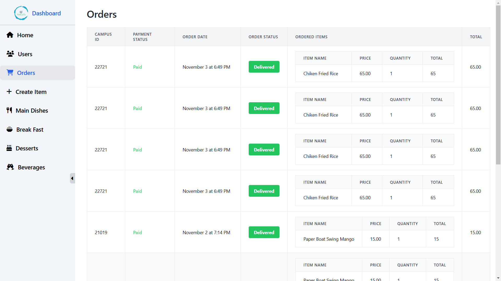

# 🍽️ **YenCafe - Food Ordering Dine-In Website for College**

## 🌟 **Overview**
YenCafe is a **MERN stack** web application tailored for college students and staff, making food ordering a streamlined process. The app provides a smooth experience for users to browse, add to cart, check out, and monitor order status. An **admin panel** ensures easy order and menu management with real-time updates to keep everything in sync.

## ✨ **Features**
- **🛒 Add to Cart**: Effortlessly add items to your cart.
- **📋 Cart Management**: Modify quantities or remove items before checkout.
- **💳 Checkout**: Fast and secure payment options.
- **💰 Payment Options**: Choose between **Razorpay** or **Cash on Delivery**.
- **📜 Order Details**: Detailed breakdown of placed orders.
- **📦 Order Tracking**: Real-time status updates from preparation to delivery.
- **🔧 Admin Panel**:
  - **CRUD Operations**: Manage food items, users, and orders.
  - **Order Management**: Real-time updates on order statuses.
  - **Edit Items**: Update item details in real-time.
  - **Create New Items**: Add new menu items with descriptions and images.
- **🔔 Real-Time Updates with Socket.io**:
  - **Order Status Updates**: Admins receive live updates on new orders and their status changes.
  - **Item Updates**: Clients see real-time changes to menu items, availability, and prices.

## 🛠️ **Technologies Used**
- **Backend**:
  - **MongoDB**: Database for user, order, and menu data.
  - **Express.js**: RESTful API and request handling.
  - **Node.js**: Server runtime for backend logic.
  - **Socket.io**: Real-time communication for live updates.
  - **Mongoose**: ODM for MongoDB.
  - **Cloudinary**: Image storage.
  - **Razorpay**: Payment gateway.
- **Frontend**:
  - **React.js**: Dynamic UI.
  - **Redux Toolkit**: State management.
  - **React Router**: SPA routing.
  - **Tailwind CSS**: Styling for responsive design.

## 🔗 **Key Tools and Libraries**
- **JWT**: Authentication.
- **Multer**: File handling.
- **bcryptjs**: Password hashing.
- **cors**: CORS configuration.
- **dotenv**: Environment management.
- **express-validator**: Input validation.

## 📦 **Project Dependencies**
### Backend
- `bcryptjs` | `cors` | `dotenv` | `express` | `jsonwebtoken` | `mongoose` | `multer` | `nodemon` | `express-validator` | `cloudinary` | `cookie-parser` | `socket.io`

### Frontend
- `react` | `react-dom` | `react-router-dom` | `react-scripts` | `tailwindcss` | `react-redux` | `redux-toolkit` | `socket.io-client`

## 🚀 **Getting Started**
To set up and run YenCafe with real-time features:

1. **Clone the Repository**:
   ```bash
   git clone https://github.com/misbah1408/YenCafe.git
   ```

2. **Navigate to the Project Directory**:
   ```bash
   cd YenCafe
   ```

3. **Install Dependencies**:
   - Backend:
     ```bash
     cd backend
     npm install
     ```
   - Frontend:
     ```bash
     cd frontend
     npm install
     ```

4. **Configure Environment Variables**:
   - Create a `.env` file in the backend directory with:
     - `PORT`, `MONGODB_URI`, `JWT_SECRET`, `CORS_ORIGIN`, `CLOUDINARY_CLOUD_NAME`, `CLOUDINARY_API_KEY`, `CLOUDINARY_API_SECRET`, `RAZORPAY_KEY_ID`, `RAZORPAY_KEY_SECRET`

5. **Run the Application**:
   - Start the Backend:
     ```bash
     npm run dev
     ```
   - Start the Frontend:
     ```bash
     npm start
     ```

6. **Open in Browser**:
   Visit `http://localhost:3000` to view the application.

## 🌐 **Live Deployment**
Check out YenCafe at: [YenCafe - Live Site](<https://yen-cafe.vercel.app>)

## 📸 **Screenshots**

1. **Register Page**  
   

2. **Login Page**  
   

3. **Home Page**  
   

4. **Items Page**  
   

5. **Cart Page**  
   

6. **Admin Panel**  
   


## 🤝 **Contributors**
- **[Mohammed Misbah](https://github.com/misbah1408)**: Project Lead, Backend & Frontend Development